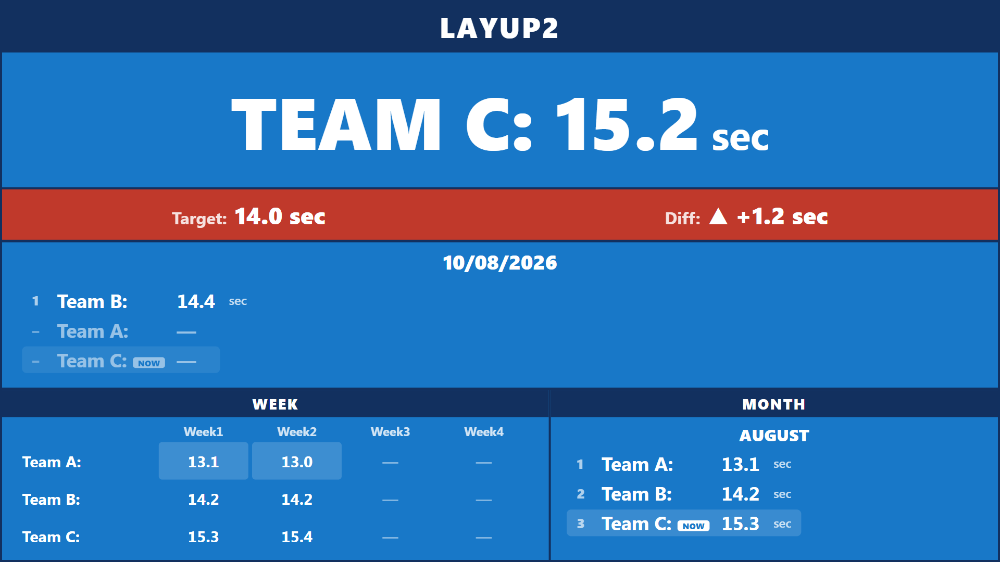
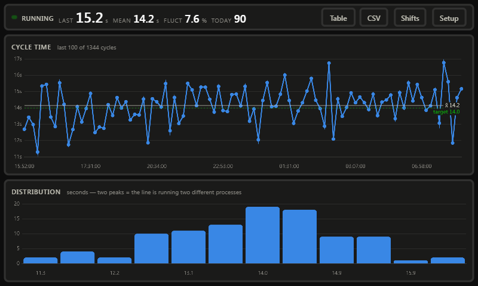
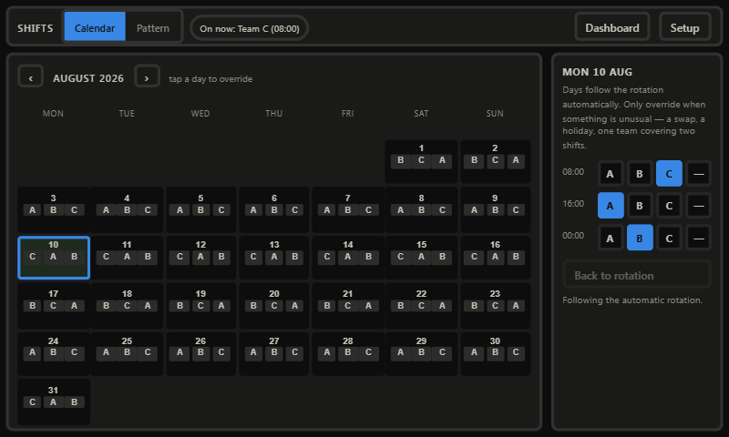

# Conveyor Cycle-Time Tracker

Watches a conveyor with a USB camera, shows how much your cycle time
**fluctuates**, and scores your shift teams against each other — live, on the
factory floor, with no network and no cloud.

A camera looks down at the belt. You drag a box over the spot product passes
through. Every time a product crosses that box the time is recorded and stamped
with the team on shift. Two screens:

- **7" touchscreen** — run chart with control limits, distribution histogram,
  camera setup, and the shift calendar.
- **40" wall board** — live seconds-per-piece for the team on shift, diff
  against target, and day / week / month team rankings with the best on top.





## What you need

| | |
|---|---|
| Computer | Raspberry Pi 5, 8 GB (a Pi 4 works too) |
| Camera | Any USB webcam (UVC). 640×480 is plenty |
| Control screen | Official 7" DSI touchscreen, 800×480 |
| Wall screen | Any HDMI display, 1920×1080 (40" here) |
| Lighting | Even light on the box you draw — see [Aiming the camera](#aiming-the-camera) |

No PLC, no sensors, no wiring into the machine.

> **คู่มือภาษาไทยสำหรับพนักงานหน้างาน: [user-manual.html](user-manual.html)**
> Thai-language operator manual — open it in a browser, or print to PDF to share.
> This README is the technical/install reference; the manual is the day-to-day one.

---

## Install on the Pi

Raspberry Pi OS **Bookworm** (64-bit, Desktop) on a Pi 5. Run as the normal
desktop user — **not** with `sudo`; the script escalates only where it needs to.

```bash
git clone https://github.com/natn2014/ImageHash_CycleTime.git ~/cycletime
cd ~/cycletime
bash deploy/install.sh
```

The installer sets the timezone, installs dependencies, creates the virtualenv,
verifies the OpenCV stack actually imports, registers a systemd service that
starts at boot, and configures both screens to come up at login. It prints the
cameras and displays it found so you can confirm the hardware is seen.

Allow 5–15 minutes — the OpenCV wheel is large on a Pi.

Then:

1. Open **http://localhost:8000/setup** → drag a box across the belt → **Save ROI**
2. Open **http://localhost:8000/shifts** → **Pattern** → adjust the anchor date
   until **Next 14 days** matches the real roster
3. Let product run, and check the numbers against a stopwatch

```bash
journalctl -fu cycletime      # watch cycles being detected
sudo systemctl restart cycletime
timedatectl                   # must show your local timezone, not UTC
```

### Timezone — read this one

**The shift roster runs entirely on local time.** Which team gets credit for a
cycle, and which production day it belongs to, both come from the Pi's wall
clock. A Pi left on UTC files every cycle against the wrong shift — 7 hours out
in Thailand — and nothing on screen looks broken until someone checks the
numbers.

The installer sets `Asia/Bangkok` automatically. Elsewhere:

```bash
CYCLETIME_TZ=Asia/Singapore bash deploy/install.sh
```

A Pi has no battery-backed clock, so it boots at epoch until NTP syncs. On a
line with no network, fit an RTC module or expect the first few minutes after a
power cut to be mis-dated.

### Updating

`install.sh` is idempotent, so it is also the update path:

```bash
cd ~/cycletime && git pull && bash deploy/install.sh
```

`config.json` and `data/cycles.db` are **not tracked by git**, so your ROI,
shift roster and recorded history all survive an update untouched.

`config.example.json` is the tracked template. The installer copies it to
`config.json` on a fresh install and never overwrites an existing one — this is
why a tuned line can be updated without being re-tuned.

### The two screens

| URL | Screen | Shows |
|---|---|---|
| `/` | 7" DSI | Run chart, histogram, live stats |
| `/board` | 40" HDMI | Team scoreboard |
| `/setup` | 7" DSI | Camera aiming and detection thresholds |
| `/shifts` | 7" DSI | Shift calendar and rotation pattern |

`deploy/kiosk.sh` lays the outputs side by side with `wlr-randr` (DSI at x=0,
HDMI at x=800) and starts two Chromium instances positioned onto each.

**Each browser needs its own `--user-data-dir`, and the script sets one.** A
second Chromium sharing a profile does not open a second window — it hands the
URL to the running instance and exits, leaving the 40" blank. If you edit that
script, keep the separate profiles.

If window placement misbehaves under Wayfire, pin them by app-id instead in
`~/.config/wayfire.ini`:

```ini
[window-rules]
r1 = on created if app_id is "chromium-browser" then move 800 0
```

## Try it on Windows first

Everything runs on a normal PC with any webcam — useful for learning the
controls before you go near the line.

```bash
pip install -r requirements.txt
python run.py
```

Open http://localhost:8000/setup, drag a box somewhere on your desk, and wave
your hand through it. Each pass logs a cycle.

---

## Aiming the camera

**This is the part that decides whether the numbers are any good.** The
detection is brightness-difference based, so it is fast and needs no training —
but it believes anything that changes inside the box is product.

Do:
- Point the camera **down at the belt**, as square-on as you can
- Draw the box just wider than one product, well inside the belt edges
- Add a small fixed LED bar if the area is dim
- Watch the **Occupancy** meter on the setup page while product runs: it should
  sit near 0 % on an empty belt and jump well past the red mark as product passes

Avoid:
- Sunlight from a window, or anything that moves the shadows
- Operators, forklifts or hands crossing through the box
- Including the belt edge or a reflective guard rail in the box

### Tuning

Only touch these if the counts are wrong. All four are on the setup page and
save instantly.

| Setting | Raise it when | Lower it when |
|---|---|---|
| **Enter ratio** (0.15) | Shadows/noise trigger false counts | Small product isn't detected |
| **Exit ratio** (0.07) | Product isn't seen as "gone" between pieces | The box flickers empty mid-product |
| **Pixel threshold** (25) | The image is noisy or grainy | Product barely differs from the belt |
| **Dwell** (0.3 s) | Brief flickers get counted | Fast product is missed |

Exit must stay below enter — the gap between them is what stops one product
being counted twice.

**Prove it before you trust it:** hand-count 20 consecutive products with a
stopwatch and compare against the dashboard. Expect one round of tuning.

---

## Reading the dashboard

**Run chart** — every cycle in sequence. This is where fluctuation shows up.

- **x̄** solid line — your average cycle
- **UCL / LCL** dashed red — control limits. Points outside are *not* normal
  variation; something specific happened
- **target** dotted green — your goal (set `cycle.target_s` in `config.json`)
- **Red dots** — out-of-control cycles, drawn larger as well as coloured

A healthy line looks like random scatter tight around x̄. Watch for a drift up
(tooling wearing), a step change (shift or material change), or a repeating
sawtooth (something happening every Nth piece).

**Distribution** — the shape of the variation. One clean peak is a stable
process. **Two peaks means the line is really running two different processes**
— often an operator intervention on some pieces but not others. That single
insight is usually the first thing this tool finds.

**Fluct %** in the header is the coefficient of variation. It is scale-free, so
it stays comparable when you change product or line speed. Lower is better.

**Table** button switches to a text view of every cycle, including stoppages.
**CSV** downloads the whole history for Excel.

### Stoppages

Any gap longer than `cycle.max_valid_s` (default 5 minutes) is recorded as a
*stoppage*, not a cycle. It is excluded from the chart, the average and the
control limits — otherwise one tea break rescales the chart and hides all the
real variation. Stoppages still appear in the header chip, the table and the CSV.

---

## Shift teams

Three teams cover 24 hours in three 8-hour shifts. **The roster is calculated,
not typed in** — you set the pattern once and the calendar fills itself forever.
You only tap a day when something is unusual.



### Setting the pattern (do this once)

**Shifts → Pattern**:

| Field | Default | Meaning |
|---|---|---|
| Shift 1/2/3 start | 08:00 / 16:00 / 00:00 | Each shift runs 8 hours from its start |
| Teams | A,B,C | One per shift, in rotation order |
| Rotate every | 7 days | How often teams move to the next shift |
| Rotation anchor | a date | A day on which Team A is on shift 1 |

**Do not count weeks to work out the anchor.** Change the date and watch the
**Next 14 days** preview beside it until it matches who is really on shift.
That is the whole point of the preview.

Shift order follows the order you enter the times, not the clock. Listing
`08:00, 16:00, 00:00` means shift 1 is the 08:00 day shift and shift 3 is the
00:00 night shift — which is how the plant talks about them.

### Overriding a day

**Shifts → Calendar**. Each cell shows the three teams for that day. Tap a day,
then tap a team for any shift. Overridden slots are marked in amber and
underlined. **Back to rotation** clears the day.

Choose **—** to record that *nobody* was on that shift — a holiday, or an idle
line. That is different from leaving it alone: `—` means no team, while an
untouched day follows the rotation.

### Which day does a shift count toward?

A shift's cycles count to the day the **shift started**. With 08:00/16:00/00:00
no shift crosses midnight, so this changes nothing. It matters if you switch to
a late-start pattern: with a 22:00 shift, cycles recorded at 02:00 count toward
the *previous* day, keeping one shift's performance in one bucket.

### If the calendar was wrong

Attribution is stamped when the cycle is recorded, so fixing the calendar later
does not silently rewrite history. When you *do* want history corrected — a
shift swap entered a day late — fix the calendar, then:

```bash
curl -X POST http://localhost:8000/api/shifts/recompute \
     -H 'Content-Type: application/json' \
     -d '{"start":"2026-08-01","end":"2026-08-07"}'
```

Omit the body to re-stamp everything.

---

## Reading the 40" board

- **TEAM x: N sec** — the team on shift now, and the latest cycle time.
- **Diff bar** — green while within `diff_tolerance_s` of target, red beyond.
  The arrow and the signed number say the same thing as the colour, so it still
  reads in a monochrome photo.
- **Day / Month** — average per team, **best cycle time on top**, with an
  explicit rank number. A team that has not run shows `—` and sorts last, never
  first.
- **Week** — W1 = days 1–7, W2 = 8–14, W3 = 15–21, W4 = 22–end of month. The
  best cell in each column is highlighted.
- **NOW** tag marks the team currently on shift.

Stoppages are excluded from every average, the same as on the dashboard.

If the board loses contact with the tracker it dims and shows **NO DATA**
rather than leaving a stale number on the wall to be believed.

---

## Configuration

`config.json`, next to `run.py`. The setup page writes `roi` and `detector`,
the Shifts tab writes `shifts`; everything else is edited by hand.

```json
{
  "station":  { "name": "LAYUP2" },
  "camera":   { "index": 0, "width": 640, "height": 480, "fps": 15, "fourcc": "MJPG" },
  "roi":      { "x": 200, "y": 150, "w": 240, "h": 180 },
  "detector": { "enter_ratio": 0.15, "exit_ratio": 0.07, "diff_threshold": 25,
                "bg_alpha": 0.02, "min_present_s": 0.3 },
  "cycle":    { "max_valid_s": 300, "target_s": 14.0, "diff_tolerance_s": 1.0 },
  "shifts":   { "starts": ["08:00", "16:00", "00:00"], "teams": ["A", "B", "C"],
                "rotation_days": 7, "rotation_anchor": "2026-08-03",
                "rotation_direction": 1 },
  "store":    { "db_path": "data/cycles.db", "retain_days": 90 },
  "server":   { "host": "0.0.0.0", "port": 8000 }
}
```

Set **`station.name`** to the line name shown on the board — this is the only
change needed to label a second unit `LAYUP1`.
Set **`cycle.target_s`** to your takt time — it draws the target line and feeds
the board's diff bar. **`diff_tolerance_s`** is how far over target the bar
stays green.
Keep **`"fourcc": "MJPG"`** — on the default YUYV many webcams silently drop to
about 5 fps.

A bad value here is repaired rather than rejected: an unparseable shift time or
a team count that does not match the number of shifts falls back to the default
so the line display still boots.

Command-line flags (`--camera 1`, `--port 8080`) override the file for one run
without changing it.

## Data

Every cycle goes to `data/cycles.db` (SQLite), pruned to `retain_days`
automatically. Roughly 3 000 cycles/day is under 1 MB/month.

```
GET /api/export.csv                                   # everything
GET /api/export.csv?start=2026-08-01&end=2026-08-07   # a date range
```

The CSV carries both UTC and local time plus `team`, `work_date` and
`shift_slot`, so per-team analysis works straight in a pivot table.

---

## How it works

```
capture thread          detector thread              web server
──────────────          ───────────────              ──────────
grab newest frame  ───▶  ROI brightness diff   ───▶   SQLite
stamp it with            vs frozen background         dashboard + board
time.monotonic()         state machine + dwell        SSE push per cycle
                         stamp team from roster
```

Four decisions carry most of the accuracy:

**Frames are timestamped at grab, on a monotonic clock.** A webcam buffers
frames; reading at processing speed drifts further behind real time every
frame. A dedicated thread always holds the newest frame, and a monotonic clock
means an NTP correction mid-shift cannot invent a cycle.

**The background freezes while the box is occupied.** A conventional background
subtractor keeps learning, so a product that stops on the belt gets absorbed
into the background and the next movement fires a phantom count. Freezing means
a stopped line reads as one long cycle — the truth. It still learns while the
box is empty, which absorbs lighting drift across a shift. If the whole scene
changes while occupied (someone hits the lights), a guard forces a relearn
rather than wedging.

**Control limits use the I-MR method**, `σ̂ = MR̄ / 1.128`, not a raw standard
deviation. A raw σ is inflated by the very outliers you are hunting, widening
the limits until nothing ever signals.

**The team is stamped onto the cycle when it is recorded**, not joined from the
roster when the board is drawn. Recorded history therefore reflects what the
schedule said when the product was actually made, and editing next week's
calendar cannot silently move last month's numbers. `/api/shifts/recompute` is
the deliberate way to change that.

---

## Testing

```bash
python -m pytest tests/ -q
```

98 tests, no hardware needed.

`tests/make_synthetic_video.py` renders a synthetic conveyor with products at
exactly known intervals; the detector must recover those intervals to within
one frame period. To watch the scene:

```bash
python tests/make_synthetic_video.py --intervals 8,12,9,15,11 --out belt.mp4
```

`tests/test_shifts.py` covers the roster as pure arithmetic — rotation forward
and backward, shift boundaries to the second, the shift-start production-day
rule under a midnight-crossing pattern, and the difference between "no override"
and "nobody on shift". `tests/test_team_store.py` covers the database migration
running repeatedly against the same file, which is what happens on every deploy.

## Troubleshooting

| Symptom | Cause and fix |
|---|---|
| **NO CAMERA** | `v4l2-ctl --list-devices`. Check the cable; try `--camera 1`. On the Pi the user must be in the `video` group (log out and back in after install) |
| **Nothing is counted** | Occupancy never passes the red mark — lower **Enter ratio** or **Pixel threshold**, or make the box smaller so product fills more of it |
| **Counts double** | Widen the gap between **Enter** and **Exit**, or raise **Dwell** |
| **Random counts on an empty belt** | Something moves in the box — shadow, person, sunlight. Re-aim first; raise **Pixel threshold** second |
| **Stuck on PRODUCT** | Lighting changed, or the box includes something that moved permanently. It self-recovers after `max_valid_s`; re-save the ROI to force it now |
| **Chart is empty but cycles log** | All gaps are being flagged as stoppages — raise `cycle.max_valid_s` |
| **Camera runs slow** | Confirm MJPG: `v4l2-ctl --list-formats-ext` |
| **Screen blanks** | `deploy/kiosk.sh` disables blanking; make sure it's in `~/.config/autostart` |
| **40" stays blank / both screens show the same page** | The two Chromium instances are sharing a profile. Each needs its own `--user-data-dir` — see `deploy/kiosk.sh` |
| **Both pages open on one screen** | `wlr-randr` didn't position the outputs. Run it to see the detected names, then use the `wayfire.ini` window rule above |
| **Wrong team on the board** | Check **Shifts → Pattern** preview against reality and adjust the anchor date. Past data is corrected with `/api/shifts/recompute` |
| **Board shows "NO TEAM SCHEDULED"** | That shift is set to `—` on the calendar. Tap the day and pick a team |
| **A team shows `—` all month** | It has recorded no cycles — check the rotation covers it, and that the camera was running on its shifts |

## Limits

This counts **passes, not good parts**. Two products touching may read as one;
it cannot tell a good piece from a reject. It measures the gap between products
at one point on the belt — which is exactly what cycle-time fluctuation means,
but it is not a quality system.
